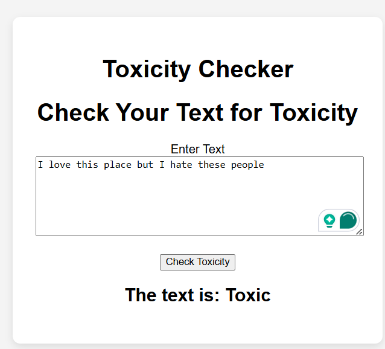

# Toxic Text Classifier

ML project

- Install VSCODE https://code.visualstudio.com/

- Install ANACONDA https://www.anaconda.com/

- Install GIT BASH https://git-scm.com/downloads

- MLOPs Tool: https://www.evidentlyai.com/

- Virtual environment creation
   ```python -m venv us_visa```

- To create the folders
   ```python template```

- Install all the requirements
   ``` pip install -r requirements.txt```

- Run application without container in local
   ```python application.py```
-Run web application on local machine like this: http://192.168.1.6:5000/predictdata


- Run the application in docker container
   ```docker run Dockerfile```
   
- Summary

Created a end to end machine learning using visa approval project which is having following components:-

1. Data ingestion : which will extract the data from mongodb database and convert it into csv file.

2. Data validation: validate data that test and train dataset is of same distribution using evidently ai library.

3. Data transformation: transform the features like numerical and categorical in this way
-For numerical feature dont have normal distribution, convert them into normal distribution using yeo jonshon method.
- for categorical features having categories less than 3 is using ordinal encoding and features having more than 3 categories using one hot encoding.
above tranformation is used to create preprocessing.pkl object to tranform the train and test data.

4. Data training: train the all the mentioned models in the model.yaml file and choose the best one having accuracy either more than 60 % or greater the model in the production.
note:- production model os stored in s3 bucket.
if it has accuracy more than production model accuray than it replaces the production model.

5. fast api is created to perform prediction and training on new dataset.


# AWS-CICD-Deployment-with-Github-Actions

## 1. Login to AWS console.

## 2. Create IAM user for deployment

	#with specific access

	1. EC2 access : It is virtual machine

	2. ECR: Elastic Container registry to save your docker image in aws


	#Description: About the deployment

	1. Build docker image of the source code

	2. Push your docker image to ECR

	3. Launch Your EC2 

	4. Pull Your image from ECR in EC2

	5. Lauch your docker image in EC2

	#Policy:

	1. AmazonEC2ContainerRegistryFullAccess

	2. AmazonEC2FullAccess

	
## 3. Create ECR repo to store/save docker image
    - Save the URI: 315865595366.dkr.ecr.us-east-1.amazonaws.com/visarepo

	
## 4. Create EC2 machine (Ubuntu) 

## 5. Open EC2 and Install docker in EC2 Machine:
	
	
	#optinal

	sudo apt-get update -y

	sudo apt-get upgrade
	
	#required

	curl -fsSL https://get.docker.com -o get-docker.sh

	sudo sh get-docker.sh

	sudo usermod -aG docker ubuntu

	newgrp docker
	
# 6. Configure EC2 as self-hosted runner:
    setting>actions>runner>new self hosted runner> choose os> then run command one by one


# 7. Setup github secrets:

   - AWS_ACCESS_KEY_ID
   - AWS_SECRET_ACCESS_KEY
   - AWS_DEFAULT_REGION
   - ECR_REPO

    


